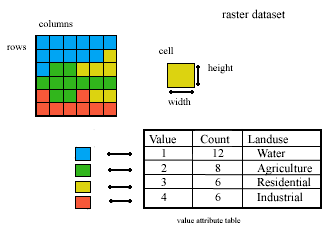
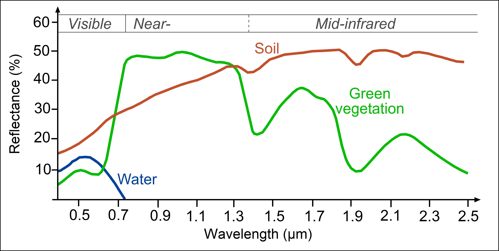

# LandClassifier

## What is this program about?
This program is to implement basic remote sensing for land use system.
I also try to use object-oriented paradigm in developing the module.

## Algorithms and concepts
The module comprises a main data structure model called <a href= "https://sanlocoz.github.io/LandClassifier/#LandClassifier.RasterMap"> RasterMap</a>.
>RasterMap is a class that represents raster map with a total pixel of totalX * totalY. Each cell is pixelsizeX by pixelsizeY in size. Each cell can contains multivalue that given in array-like value in **kwargs.

RasterMap is basically like other raster object, where it holds pixel values that are given in dictionary of name of the layer and the raster map (that hold the values) that could be supplied through **kwargs. 

*Basic concepts of raster object (ArcGIS Resources)*

In remote sensing of land cover, one of the well known parameters is NDVI (Normalized difference vegetation index).
NDVI use NIR (near-infrared) and RED reflectance to differentiate vegetation and other land cover.

There are differences in terms of distribution of NIR-RED plots for each land cover type. The characteristics of each land cover (soil, vegetation and water bodies) could be seen in the figure below:

*Reflectance characteristics of soil, vegetation and water bodies (SEOS project)*

From the figure above there are some characteristics that we could derived:
- Water only reflects visible light range and the value is significantly lower than other two land use (soil and vegetation)
- Vegetation has a jump in the reflectance from RED (visible light) to NIR (near infrared). It is because visible blue and red light is used in photosynthesis.
Meanwhile near infrared is significantly reflected because it is not used in the process of photosynthesis.
- Soil reflectance increases slightly from visible light range to near infrared light. 
The reflectance is also dependent on type of the soil itself, moisture content and the mineral it is composed of.

For artificial map generation that is used for testing purposes, the pixel of the map is generated with these underlying criteria:

`Water,`
$$NIR <= 0.1 and RED <= 0.1$$  
`Vegetation, 0.3 <= NIR <= 0.8 and RED <= 0.1`  
`Soil, 0.20 <= NIR <= 0.40 and 0.20 <= RED <= 0.40`

The implementation is in <a href = "https://sanlocoz.github.io/LandClassifier/#LandClassifier.GenerateWaterSoilVegetationRandomMap">GenerateWaterSoilVegetationRandomMap</a> function within the module.

## Sample graphical output of the classification

## What to do next?
This raster object is implemented for learning purposes. There are many advanced algorithms that has been implemented in GIS softwares and GDAL codebase.
For learning purposes, one could implements algorithm in raster object such as delineation of catchment or even flood fill algorithm given bounding box in polygon (for example).

## Further information
The detail functionality of the module can be found <a href= "https://sanlocoz.github.io/LandClassifier/"> here</a>.

## References
SEOS-project.eu. n.d. SEOS Tutorials. [online] Available at: <https://seos-project.eu/> [Accessed March 2022]. 